# Galatiq Case: Invoice Processing Automation

This repository is a working local prototype for evidence-preserving invoice processing. It reads mixed-format invoice files, normalizes claims with source evidence, validates semantics, arithmetic, and inventory, applies approval policy, and executes a local mock payment only after approval.

## Quick Start

Use Python 3.13 or later from this directory:

```bash
python -m pip install -e ".[ingestion,ingestion-dev]"
```

Copy `.env.example` to `.env` and set `XAI_API_KEY` for the default Grok provider. The default model is `grok-3-mini`. To use TAMUS instead, set its `TAMUS_AI_CHAT_*` values and add `-tamu` to the command. Then run:

```bash
python main.py --invoice_path=data/invoices/invoice_1001.txt
python main.py -tamu --invoice_path=data/invoices/invoice_1001.txt
python main.py --eval-workflow
python dashboard.py
```

The live CLI prints progress and a terminal `WorkflowStatus`. It creates JSON artifacts under `logs/runs/<run_id>/`. Only `APPROVED_AND_PAID` exits with code 0. Payment is simulated and has no external banking side effect.

## Architecture

```mermaid
flowchart LR
    Source[Invoice source] --> Ingestion[Read, normalize, critique]
    Ingestion --> History[Invoice history ledger]
    History --> Validation[Semantic, reconciliation, inventory]
    Validation --> Approval[Business Rule and optional VP]
    Approval --> Payment[Payment preflight and mock provider]
    Payment --> Result[WorkflowResult and audit artifacts]
    Result --> Dashboard[Read-only dashboard]
```



The code and tests are the source of truth. The main orchestration is in [`src/invoice_system/workflow.py`](src/invoice_system/workflow.py); the CLI is [`main.py`](main.py). The dashboard reads saved artifacts and cannot change a decision.

## Capabilities

- PDF native text, TXT, Markdown, CSV, JSON, and XML source handling.
- Immutable source chunks and field-level evidence.
- LLM structured extraction and policy reasoning through selectable Grok or TAMUS-compatible chat endpoints.
- Bounded ingestion and validation critic/revision loops.
- Decimal reconciliation and auditable SQLite inventory lookups.
- Duplicate suppression, paid-revision routing, approval policy, and VP review.
- Local mock payment with idempotency and audit artifacts.
- Stage-specific and end-to-end evaluation suites plus an offline pytest suite.

## Documentation

Read the [reviewer documentation](docs/README.md) for the full architecture, agent responsibilities, contracts, data flow, evaluation model, dashboard, and implementation map. The existing [documentation index](docs/index.md) links the deeper implementation guides.

## Important Limits

OCR, external banking, hosted service deployment, dashboard-driven human decisions, and workflow resumption are not implemented. A human-review result is recorded as a terminal local status until a future controlled service exists.
