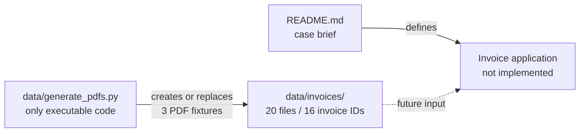

# Repository Guide

This folder documents the repository as it exists at the starting commit. It also maps the system described by the case brief without presenting that proposed system as implemented code.

## Start here

| Document | What it answers |
|---|---|
| [Current system](current-system.md) | What is in the repository now? What is missing? |
| [Entry points](entry-points.md) | What can be run or consumed, and where would execution begin? |
| [Invoice corpus](invoice-corpus.md) | What does each sample invoice test? |
| [Target architecture](target-architecture.md) | How should the requested system fit together? |
| [Agent contracts](agent-contracts.md) | What does each agent own, receive, return, and call? |
| [Ingestion pipeline plan](ingestion-pipeline-plan.md) | How will source documents become evidence-backed typed invoice candidates? |
| [Implementation roadmap](implementation-roadmap.md) | In what order should it be built and verified? |

## At a glance

The repository is a challenge scaffold:

- `README.md` defines the business problem and acceptance criteria.
- `data/invoices/` provides deliberately varied and flawed inputs.
- `data/generate_pdfs.py` regenerates three PDF fixtures.
- There is currently no application CLI, agent orchestration, inventory database, payment integration, UI, dependency manifest, or automated test suite.

## Terminology

- **Present** means a file or behavior exists in this repository now.
- **Specified** means the root README requires it, but it is not implemented.
- **Proposed** means these docs recommend a concrete design; it is not yet a repository contract.

## Agreed development direction

The planned application is explicitly a **four-agent LangGraph system**:

1. an Ingestion Agent extracts and interprets document content;
2. a Validation Agent investigates claims through constrained tools;
3. an Approval Agent makes the business disposition;
4. a Critic Agent challenges that decision before it becomes final.

Ordinary code remains responsible for exact operations such as arithmetic, grouping rows, parameterized SQL, schema validation, audit persistence, and idempotent payment. This does not make the system less agentic: agents decide what evidence is needed and reason over it, while tools provide reliable facts.
