# Galatiq Invoice Processing System

This repository is a local, evidence-preserving invoice-processing prototype. It turns a supported invoice document into a typed workflow result: the invoice is read without interpreting fields, normalized with source evidence, validated semantically and against arithmetic and inventory rules, routed through approval, and paid only through a local mock provider.

The implementation is deliberately fail-closed. A model may propose structured reasoning, but typed contracts, deterministic arithmetic, SQLite lookups, approval gates, the invoice-history ledger, and payment preflight control what can happen next.


## Project Overview

The original business case is an Acme manufacturing company losing money and time to manual invoice extraction, inventory checks, approval email chains, and payment processing. This repository implements the working local prototype of that workflow. It is not a bank integration or hosted approval service: payment creates a mock transaction ID, and human review stops the workflow for a later operator decision that the current dashboard cannot submit.

The system's objective is to make invoice decisions inspectable. Every meaningful handoff is represented by Pydantic models, source chunks are retained, model output is schema-validated, deterministic evidence is recorded, and reached stages write JSON artifacts under `logs/`.

## What The System Does

A normal invocation follows this route:

```mermaid
flowchart LR
    A[Supported invoice file] --> B[Source reader]
    B --> C[LLM normalizer]
    C --> D[Ingestion critic]
    D -->|issues and budget remains| C
    D -->|accepted or reviewable| E[Invoice history ledger]
    E -->|exact paid version| Z[Duplicate suppressed]
    E --> F[Semantic validation]
    F --> G[Semantic critic]
    G -->|revise, max 2| F
    G --> H[Reconciliation]
    H --> I[Reconciliation critic]
    I -->|revise, max 2| H
    I --> J[SQLite inventory]
    J --> K[Database critic]
    K -->|revise, max 2| J
    K --> L[Business Rule Agent]
    L -->|ACCEPT| M[Payment preflight]
    L -->|REJECT| R[Approval rejected]
    L -->|VP_REVIEW| N[VP Agent]
    N -->|GO| M
    N -->|NO_GO| R
    N -->|HUMAN_REVIEW_REQUIRED| Q[Human review stop]
    E -->|paid revision| N
    M --> O[Local mock payment]
    O --> P[APPROVED_AND_PAID]
```



The central orchestrator is [`src/invoice_system/workflow.py`](../src/invoice_system/workflow.py). It runs ingestion, checks the invoice-history ledger, invokes the full validation graph, invokes approval, claims payment idempotently, and calls the mock provider. It never manufactures downstream results after a stop.

## Agents And Stages

| Stage | Responsibility | Input | Output | Reasoning and side effects |
| --- | --- | --- | --- | --- |
| Source reader | Represent PDF, TXT, Markdown, CSV, JSON, or XML as immutable source chunks. | File path | `SourceDocument` | Deterministic parsing; no invoice-field interpretation. |
| Normalizer | Map source claims into `NormalizedInvoice` and attach evidence. | `SourceDocument` | `NormalizationResult` | LLM structured extraction guided by the normalization policy. It must not calculate or validate business values. |
| Ingestion critic | Find unsupported, missing, structurally wrong, or weakly evidenced claims. | Source plus normalization | `CritiqueResult` | LLM critique plus deterministic path/schema/no-op sanitization. It can request bounded revision. |
| Invoice history | Identify versions and suppress duplicate payment. | Accepted ingestion | `InvoiceHistoryDecision` | Deterministic SQLite ledger; hashes source content independently of filename. |
| Semantic specialist | Check whether normalized values are usable and semantically coherent. | Detached ingestion snapshot | `SemanticResult` | LLM reasoning; does not own arithmetic, stock, approval, or payment. |
| Reconciliation specialist | Interpret line identities and propose arithmetic status. | Ingestion snapshot | `ReconciliationResult` | LLM interpretation, with deterministic `Decimal` calculations overwriting audit fields. |
| Database specialist | Resolve products and compare requested quantity with stock. | Reconciliation mappings plus inventory SQLite | `DatabaseValidationResult` | Deterministic bulk SQL and quantity checks; LLM proposes unresolved-name retry candidates. |
| Validation critic | Review each validation specialist's result. | Stage result and evidence | `CriticResult` | Shared LLM reviewer plus deterministic database audit; `REVISE` loops are capped at two revisions per stage. |
| Business Rule Agent | Apply approval policy to an already validated/reconciled invoice. | `ApprovalRequest` | `BusinessRuleDecision` | LLM policy interpretation; no OCR, recalculation, database lookup, or field repair. |
| VP Agent | Decide escalated approval cases. | Approval request plus business-rule decision | `VPDecision` | LLM authorization reasoning; paid revisions are deterministically forced to human review. |
| Payment | Check request shape and invoke the local provider. | `PaymentRequest` | `PaymentResult` | Deterministic preflight and provider result; no external banking side effect. |
| Dashboard | Present saved results for review. | `workflow_result.json` and workflow evaluation summaries | Standalone HTML | Standard-library, read-only rendering; no model call or workflow mutation. |

The shared LLM boundary is [`src/invoice_system/agent_runtime.py`](../src/invoice_system/agent_runtime.py). It sends a Pydantic JSON Schema, retries selected transport failures up to three total requests, allows one schema-correction request, and raises on unresolved invalid output. These transport retries are separate from the ingestion and validation critic loops.

## One Invoice End To End

1. **Read.** [`source_reader.py`](../src/invoice_system/ingestion/source_reader.py) preserves pages, rows, or text as frozen `SourceChunk` objects. JSON and XML are syntax-checked; XML DTD/entity declarations are rejected. Image-only PDF pages fail because OCR is not installed.
2. **Normalize.** The normalizer maps explicit source claims to typed invoice fields and records `FieldEvidence` pointing back to chunk IDs. It preserves ambiguity in `additional_fields` and does not derive totals, dates, or quantities.
3. **Critique and gate.** The ingestion critic reviews fidelity and evidence. A `REVISE` result feeds revision instructions back to normalization while the two-revision budget remains. The gate returns `accept`, `needs_review`, or `technical_failure`.
4. **Check history.** The ledger computes a content hash and a canonical vendor/invoice-number case key. An exact paid version becomes `DUPLICATE_SUPPRESSED`; a changed version after payment is marked for VP/human review; otherwise validation continues.
5. **Validate semantics.** The Semantic specialist checks invalid values, missing/contradictory dates, negative quantities/prices, and basic line structure. Its critic may request up to two revisions.
6. **Reconcile.** If semantic validation passes, the Reconciliation specialist receives the same detached snapshot. It maps product identities and reasons about arithmetic, while `Decimal` evidence checks line totals, subtotal, and total. Repeated products are consolidated without losing source lines or prices.
7. **Check inventory.** The Database specialist performs bulk `SELECT item, stock FROM inventory WHERE item = ?` lookups. It may ask the model for meaning-preserving retry candidates for unresolved names, with at most three lookup rounds. Missing products, missing quantities, and insufficient stock produce issue codes.
8. **Approve.** Only `VALID` validation with reconciliation `PASS` can enter approval. The Business Rule Agent applies the policy, including the `$10,000` VP threshold and unusual payment terms. A VP `GO` is required for escalated cases. A paid revision is forced to `HUMAN_REVIEW_REQUIRED` and cannot authorize a second full payment.
9. **Pay.** The orchestrator claims the invoice version in the ledger, validates vendor/amount/currency, and invokes `mock_payment`. Success yields a mock transaction ID and `APPROVED_AND_PAID`; all other outcomes stop without payment or report `PAYMENT_FAILED`.

## Agent Contracts

The contract is intentionally not "every upstream value is correct." Ingestion guarantees source preservation and typed claims with evidence, not business validity. Validation receives a detached snapshot and owns semantic, arithmetic, and inventory judgments. Approval receives only after validation and reconciliation pass. Payment receives only a validated vendor, positive amount, and three-letter currency.

| Handoff | Receiver may assume | Receiver must still do | Not guaranteed |
| --- | --- | --- | --- |
| Ingestion -> history/validation | Source chunks are immutable; normalization exists for accepted/reviewable results; evidence paths are relative to the invoice. | Check identity, business validity, arithmetic, and inventory. | Correct totals, known products, or complete information. |
| Validation -> approval | Final validation is `VALID`; reconciliation result is `PASS`; structured findings and evidence are available. | Apply business policy, inspect concerns, and decide escalation. | Approval, payment eligibility beyond its own checks, or human authorization. |
| Approval -> payment | Final status is `APPROVED`; decision source and reasoning are recorded. | Build and validate payment request, claim idempotency, handle provider result. | Real-world settlement or a bank-side transaction. |
| History -> approval/workflow | Version identity and paid-prior signals are deterministic. | Route paid revisions to VP/human review and suppress exact paid duplicates. | That a new revision is safe to pay. |
| Workflow -> dashboard | Saved result reflects stages reached by that run. | Display and escape stored values. | Ability to approve, resume, retry, or mutate state. |

The full boundary discussion is in [architecture/agent-contracts.md](architecture/agent-contracts.md); concrete Pydantic types are in [architecture/data-models.md](architecture/data-models.md).

## Critic And Revision Behavior

Ingestion and each validation stage have bounded specialist/critic loops. The critic returns `AGREE` or `REVISE`. A revision receives the critic's instructions and the previous result. Ingestion uses `MAX_REVISIONS = 2`; validation uses `MAX_CRITIC_REVISIONS = 2` independently for Semantic, Reconciliation, and Database. Exhausted or unstable disagreement is denied as `unresolved_validation` rather than silently accepted. The shared transport's one schema-correction request is a separate mechanism and does not make a business decision.

Approval has no critic/revision loop. Business-rule and VP outputs are schema-validated, but an approval failure is a technical failure and a VP human-review result is terminal for this CLI.

## Terminal Outcomes

| Status | Meaning |
| --- | --- |
| `APPROVED_AND_PAID` | All gates passed and local mock payment succeeded. |
| `VALIDATION_DENIED` | Semantic, reconciliation, or inventory validation denied the invoice. |
| `APPROVAL_REJECTED` | Business Rule Agent or VP Agent rejected it. |
| `HUMAN_REVIEW_REQUIRED` | VP policy or a paid revision requires an external human decision. |
| `DUPLICATE_SUPPRESSED` | The exact paid invoice version will not be paid again. |
| `PAYMENT_FAILED` | Payment preflight or the mock provider failed after approval. |
| `TECHNICAL_FAILURE` | File, model, graph, ledger, or other technical error stopped processing. |

Only `APPROVED_AND_PAID` returns process exit code `0`; other normal terminal results return `1`.

## Dashboard

Run `python dashboard.py` after producing runs or evaluations. It generates a standalone `dashboard.html` from saved `workflow_result.json` and workflow `summary.json` files under `logs/`. The invoice view gives a reviewer a high-level picture of source text, normalized claims, evidence, validation findings, inventory results, approval/VP reasoning, payment status, and invoice-history decisions. A second view summarizes workflow evaluation results.

The dashboard is display-only. It makes no model or network calls and cannot approve, reject, submit human review, resume a workflow, retry payment, or edit the ledger. The generated page is the place to add a screenshot for a visual reviewer walkthrough; the detailed behavior and artifact contract are documented in [agents/dashboard.md](agents/dashboard.md).

## Repository Map

- [`main.py`](../main.py): nested-project CLI for one live run or one evaluation suite.
- [`src/invoice_system/workflow.py`](../src/invoice_system/workflow.py): fail-closed end-to-end orchestration and `WorkflowResult`.
- [`src/invoice_system/ingestion/`](../src/invoice_system/ingestion/): source reading, normalization, evidence, critic, graph, and run artifacts.
- [`src/invoice_system/validation/`](../src/invoice_system/validation/): Semantic, Reconciliation, Database, arithmetic, identity, database tool, critics, and validation graph.
- [`src/invoice_system/approval/`](../src/invoice_system/approval/): approval contracts, policy, Business Rule Agent, VP Agent, and graph.
- [`src/invoice_system/payment/`](../src/invoice_system/payment/): payment request/result models and mock provider runner.
- [`src/invoice_system/invoice_ledger.py`](../src/invoice_system/invoice_ledger.py): invoice version and payment-history boundary.
- [`tests/`](../tests/): deterministic regression and contract tests.
- [`evals/`](../evals/): expected outputs, approval cases, workflow manifest, and fixtures.
- [`logs/`](../logs/): generated run/evaluation artifacts; do not treat individual generated directories as source.
- [`dashboard.py`](../dashboard.py) and [`dashboard_template.html`](../dashboard_template.html): read-only presentation layer.

## Setup And Running

From `galatiq-case-invoices/`:

```bash
python -m pip install -e ".[ingestion,ingestion-dev]"
```

Copy `.env.example` to `.env` and set `XAI_API_KEY`. The model defaults to `grok-3-mini`; `XAI_MODEL` and `XAI_API_ENDPOINT` can override the defaults. `inventory.sqlite` is the default database. Use `--database-path` and `--ledger-path` for explicit paths.

```bash
python main.py --invoice_path=data/invoices/invoice_1001.txt
python main.py --invoice_path=data/invoices/invoice_1001.txt --database-path=inventory.sqlite --ledger-path=logs/invoice_ledger.sqlite
python main.py --eval-ingestion
python main.py --eval-validation
python main.py --eval-approval
python main.py --eval-workflow
python dashboard.py
```

`--eval-semantic` and `--eval-reconciliation` are compatibility aliases for `--eval-validation`. `--validate` is deprecated and does not disable full validation. Evaluation modes are mutually exclusive. A live run creates `logs/runs/<run_id>/`; begin with `workflow_result.json`, `events.jsonl`, and the stage artifacts it reached.

## Evaluation And Testing

The offline regression suite is:

```bash
python -m pytest
```

The evaluation suites use model-backed or controlled stage boundaries and compare stable structured facts: statuses, routes, issue codes, evidence, calculations, audit events, and terminal outcomes. Ingestion uses expected normalized outputs; validation uses trusted ingestion goldens and validation fixtures; approval isolates policy decisions with trusted upstream `VALID`/`PASS` inputs; workflow covers every invoice fixture and synthetic VP cases through the live route. Details and fixture locations are in [evaluation/overview.md](evaluation/overview.md).

A passing evaluation can represent a correctly denied or human-review invoice; it does not mean the invoice was paid. Conversely, an evaluation is a broad regression and situation test, not a complete proof that every live model response is correct. Some evaluation failures can reflect model variability or an expectation mismatch without meaning that every runtime path is broken; inspect the case artifacts and tests before drawing that conclusion.

## Example Execution

```text
invoice_1001.txt
  -> source chunks and immutable source.json
  -> normalized invoice plus field evidence
  -> ingestion critic agrees
  -> invoice history says NEW
  -> Semantic PASS
  -> Reconciliation PASS with Decimal calculations
  -> Database PASS for requested products and stock
  -> Business Rule Agent ACCEPT (or VP_REVIEW when policy requires it)
  -> payment preflight
  -> mock transaction ID
  -> APPROVED_AND_PAID
```

For a stock mismatch, the same path stops after Database with `VALIDATION_DENIED`. For a paid revision, history sets a deterministic review signal and the approval path ends at `HUMAN_REVIEW_REQUIRED`; the current dashboard cannot resolve that review.

## Deeper Documentation

- [Architecture overview](architecture/overview.md), [pipeline](architecture/pipeline.md), [state and data flow](architecture/state-and-data-flow.md), [contracts](architecture/agent-contracts.md), [models](architecture/data-models.md), and [design decisions](architecture/design-decisions.md).
- [Ingestion](agents/ingestion.md), [validation](agents/validation.md), [business rules](agents/business-rules.md), [VP approval](agents/vp-approval.md), [decision routing](agents/decision.md), [invoice history](agents/invoice-history.md), and [payment](agents/payment.md).
- [Evaluation overview](evaluation/overview.md), [ingestion evaluation](evaluation/ingestion-eval.md), [validation evaluation](evaluation/validation-eval.md), [approval evaluation](evaluation/approval-eval.md), and [running evaluations](evaluation/running-evals.md).
- [Setup](development/setup.md), [running](development/running.md), [configuration](development/configuration.md), [debugging](development/debugging.md), and [repository structure](development/repository-structure.md).
- [Issue codes](reference/issue-codes.md), [normalization policy](reference/normalization-policy.md), [glossary](reference/glossary.md), and the [dashboard surface](agents/dashboard.md).
