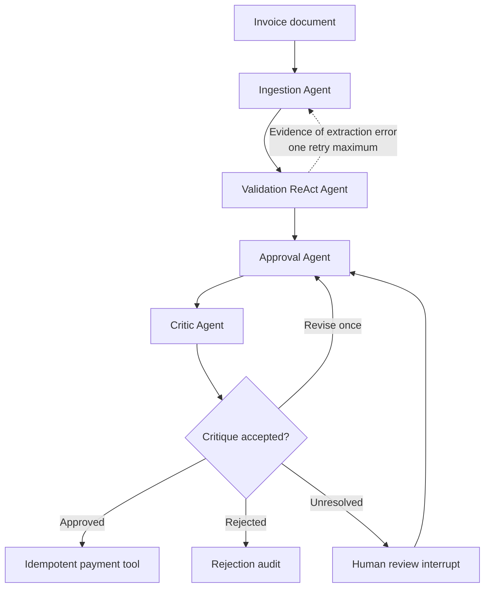

# Agent Contracts

This document is the implementation contract for the planned multi-agent system. It defines what makes each component an agent, what it may do, and what it must return. The architecture is planned and is not implemented yet.

## System rule

Each agent has a distinct goal, prompt, permitted tools, typed input, typed output, and termination condition. Agents communicate through shared LangGraph state rather than informal prose.



## Agent and tool boundary

| Component | Kind | Why |
|---|---|---|
| Interpret ambiguous invoice text | Agent | Requires contextual judgment |
| Choose additional evidence to retrieve | Agent | Requires iterative investigation |
| Decide a business disposition | Agent | Requires evidence synthesis and explanation |
| Challenge another decision | Agent | Requires independent reasoning |
| Read a file or extract PDF text | Tool | Narrow, repeatable operation |
| Group identical normalized items | Tool/code | Exact deterministic transformation |
| Recalculate money | Tool/code | Exact deterministic calculation |
| Query SQLite | Tool | Trusted, parameterized data access |
| Evaluate fixed policy predicates | Tool/code | Rules should be repeatable |
| Write an audit event or payment | Tool | Controlled side effect |

Agents must not replace deterministic tools with mental arithmetic, invented database facts, or free-form policy.

## 1. Ingestion Agent

**Goal:** determine what the submitted document claims and produce a faithful, structured interpretation with explicit uncertainty.

**Receives:**

- source path, hash, MIME/extension information;
- optional prior extraction and a specific recheck request;
- current ingestion-attempt count.

**May call:**

- format-specific readers for TXT, JSON, CSV, XML, and PDF;
- PDF text extraction and optional local OCR;
- date, money, and identifier parsers;
- controlled item-alias lookup;
- schema-validation tool.

**Must return:**

- raw extracted values and source evidence;
- a normalized `Invoice` candidate;
- every transformation from source to normalized value;
- confidence and issues for ambiguous fields;
- whether minimum extraction is complete.

**Must not:**

- check inventory or decide approval;
- silently replace unknown products or vendors;
- repair invalid business values such as negative quantities;
- discard the original text/value after normalization.

**Terminates when:** the typed schema passes, human extraction review is required, or the configured retry limit is reached.

## 2. Validation Agent

**Goal:** investigate every material invoice claim against deterministic calculations, trusted data, and fixed business rules, then return a complete report.

This is the primary ReAct agent. It may iteratively request evidence, observe results, and decide what remains unchecked.

**Receives:**

- normalized invoice and raw/source evidence;
- extraction issues and transformations;
- validation policy/version;
- whether re-ingestion has already occurred.

**May call:**

- `consolidate_line_items(items)`;
- `recalculate_invoice(invoice)`;
- `get_inventory(item_names)`;
- later, `get_vendor`, `get_purchase_order`, and `find_prior_invoice`;
- `evaluate_business_rules(invoice, findings)`;
- a graph handoff requesting a targeted ingestion recheck.

**Must return:**

- a complete list of stable finding codes;
- severity, human-readable explanation, and structured evidence for each finding;
- which checks were executed or skipped and why;
- unresolved questions;
- a non-binding validation recommendation.

**Must not:**

- generate or execute arbitrary SQL;
- stop at the first failure;
- change extracted values itself;
- approve payment;
- request re-ingestion merely because an invoice is invalid.

**Termination bounds:** configure a maximum tool-call count and allow at most one targeted re-ingestion. Exhaustion becomes `needs_review`, not an infinite loop.

### Database tool contract

The agent supplies business parameters, not SQL:

```json
{
  "item_names": ["WidgetA", "WidgetB", "GadgetX"]
}
```

The tool owns a parameterized query and returns facts:

```json
{
  "records": [
    {"item": "WidgetA", "stock": 15},
    {"item": "WidgetB", "stock": 10},
    {"item": "GadgetX", "stock": 5}
  ],
  "unknown_items": []
}
```

## 3. Approval Agent

**Goal:** choose `approved`, `rejected`, or `needs_review` from the complete evidence and explain the choice.

**Receives:**

- normalized invoice;
- extraction issues;
- complete validation report;
- applicable business-policy results;
- prior critic feedback when revising.

**May call:**

- read-only policy explanation/lookup tools;
- no inventory or payment mutation tools.

**Must return:**

```json
{
  "outcome": "approved | rejected | needs_review",
  "payment_authorized": false,
  "reasons": [],
  "addressed_finding_codes": [],
  "human_review_questions": []
}
```

For an approved decision, `payment_authorized` may become true only when there are no blocking or unresolved findings. A high-value invoice may require human review without being inherently rejected.

**Must not:**

- repeat extraction or validation work;
- ignore a finding without explaining why it is non-blocking;
- call the payment tool;
- invent policy, evidence, or corrections.

## 4. Critic Agent

**Goal:** independently test whether the proposed approval decision is complete, evidence-based, and policy-consistent.

**Checks:**

- every blocking and review finding was addressed;
- reasons cite available evidence;
- outcome and `payment_authorized` agree;
- no facts or policy were invented;
- rejection was not used where uncertainty requires review;
- approval satisfies every mandatory gate.

**Returns:**

```json
{
  "accepted": false,
  "problems": [
    {
      "code": "UNADDRESSED_FINDING",
      "message": "The decision did not address TOTAL_MISMATCH."
    }
  ],
  "requested_action": "revise"
}
```

The Approval Agent gets one revision. If the Critic still rejects it, the workflow becomes `needs_review`.

## Human review contract

Human review is a persisted LangGraph interrupt, not an error. The UI must display:

- the original document;
- raw and normalized field values;
- proposed corrections and confidence;
- validation findings with database/calculation evidence;
- the proposed decision and critic feedback;
- structured actions: approve, reject, correct fields and revalidate;
- a required reviewer reason for overrides.

The first version should not offer an unrestricted prompt that can redefine policy. Reviewer comments are evidence/audit context, while actions remain structured.

## Payment contract

Payment is a tool, not an agent. Before recording a simulated payment, it independently verifies:

- final decision is `approved`;
- `payment_authorized` is true;
- no blocking/unresolved findings remain;
- a human approval is present when policy required it;
- the idempotency key has not already been paid.

The idempotency key should derive from vendor identity, invoice number, revision, currency, and amount. Reprocessing returns the existing result rather than paying twice.

## Shared-state outline

```python
class InvoiceWorkflowState:
    run_id: str
    source_path: str
    source_hash: str

    raw_extraction: RawExtraction | None
    normalized_invoice: Invoice | None
    extraction_issues: list[ExtractionIssue]
    transformations: list[Transformation]

    consolidated_items: list[ConsolidatedItem]
    validation_findings: list[ValidationFinding]
    validation_checks: list[ValidationCheck]
    validation_complete: bool

    proposed_decision: ApprovalDecision | None
    critique: CritiqueResult | None
    final_decision: ApprovalDecision | None

    ingestion_attempts: int
    validation_tool_calls: int
    approval_revisions: int

    human_review: HumanReview | None
    payment: PaymentResult | None
    audit_events: list[AuditEvent]
```

The exact syntax may change during implementation, but these responsibilities and separations are architectural constraints.

## Example: `INV-1013`

1. Ingestion extracts eight source rows and the declared `$22,562.80` total.
2. The Validation Agent asks the consolidation tool to produce `WidgetA=22`, `WidgetB=18`, and `GadgetX=9`.
3. It calls the inventory tool and observes available stock of 15, 10, and 5.
4. It calls the arithmetic tool and observes a computed `$22,512.80` total—a `$50` variance.
5. It continues through all rules and returns all stock, total, and high-value findings.
6. The Approval Agent proposes rejection with evidence.
7. The Critic verifies that every finding was addressed.
8. The graph writes a rejection audit and never enters the payment node.
