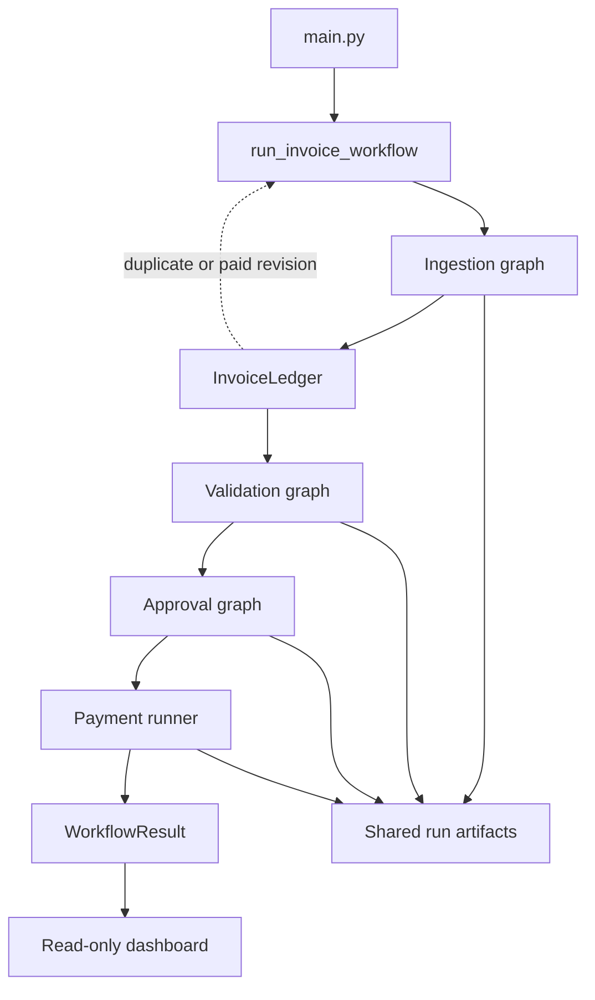

# Architecture Overview

The application is a Python CLI with typed stage boundaries. [`main.py`](../../main.py) selects a live workflow or an evaluation suite. [`workflow.py`](../../src/invoice_system/workflow.py) owns fail-closed orchestration; domain packages own stage computation.

## Ownership

- Ingestion reads supported formats, preserves source chunks, normalizes claims, records evidence, and runs its critic loop.
- Invoice history uses a separate SQLite store for version identity, duplicate suppression, and payment claims. It is not an inventory database.
- Validation runs Semantic, Reconciliation, and Database stages in order when the live workflow requests the full graph.
- Approval requires validation `VALID` and reconciliation `PASS`, then runs Business Rule and optional VP decisions.
- Payment validates a `PaymentRequest` and calls only the injectable local provider.
- The dashboard reads saved results and cannot mutate workflow state.

## Model boundary

[`agent_runtime.py`](../../src/invoice_system/agent_runtime.py) is the only shared xAI Grok transport. It supplies Pydantic JSON Schema in the system message, validates returned JSON locally, retries selected transient failures three times total, and requests one schema correction. Stage critics are separate application-level loops.

The architecture intentionally combines nondeterministic interpretation with deterministic controls. Model output proposes normalization, semantic conclusions, retry names, and approval reasoning. Frozen source models, Pydantic validation, Decimal calculations, SQL lookups, status gates, ledger claims, and payment preflight constrain the effects of those proposals.

See [pipeline](pipeline.md), [state and data flow](state-and-data-flow.md), and [design decisions](design-decisions.md) for the implementation-level walkthrough.
