# Pipeline And Routing

The live path in [`run_invoice_workflow`](../../src/invoice_system/workflow.py) is deterministic around stage calls:

```mermaid
flowchart LR
    R[read_source] --> N[normalize]
    N --> IC[ingestion critic]
    IC -->|REVISE and budget| N
    IC -->|gate| H[invoice history]
    H -->|duplicate paid| STOP1[DUPLICATE_SUPPRESSED]
    H --> S[Semantic]
    S --> SC[Semantic critic]
    SC -->|REVISE and budget| S
    SC -->|PASS| RC[Reconciliation]
    RC --> RCC[Reconciliation critic]
    RCC -->|REVISE and budget| RC
    RCC -->|PASS| DB[Database]
    DB --> DBC[Database critic]
    DBC -->|REVISE and budget| DB
    DBC -->|PASS| BR[Business Rule]
    BR -->|ACCEPT| PF[Payment preflight]
    BR -->|VP_REVIEW| VP[VP Agent]
    VP -->|GO| PF
    PF --> MP[Mock payment]
```

## Ingestion graph

`read_source -> normalize -> critic -> gate` is implemented in [`ingestion/graph.py`](../../src/invoice_system/ingestion/graph.py). A critic issue routes to `revise` while `MAX_REVISIONS` permits it. Instability or exhausted revisions reaches the gate without another revision. The gate returns `ACCEPT`, `NEEDS_REVIEW`, or a technical failure result.

## Validation graph

[`validation/graph.py`](../../src/invoice_system/validation/graph.py) runs Semantic first. The live workflow enables Reconciliation and Database. Each stage has its own critic count, with two revisions configured. A denied specialist result becomes `ValidationStatus.DENIED`; unresolved critic disagreement becomes denial with `unresolved_validation`; an exception becomes `TECHNICAL_FAILURE`.

## Approval graph

[`approval/graph.py`](../../src/invoice_system/approval/graph.py) runs Business Rule first. `ACCEPT` and `REJECT` complete directly. `VP_REVIEW` invokes the VP Agent and then completes with `APPROVED`, `REJECTED`, or `HUMAN_REVIEW_REQUIRED`. Paid invoice revisions are forced into the VP branch by invoice history and are forced to human review after the VP model response.

## Workflow terminal routing

- Ingestion failure -> `TECHNICAL_FAILURE` at `ingestion`.
- Exact paid version -> `DUPLICATE_SUPPRESSED` at `invoice_history`.
- Validation denial -> `VALIDATION_DENIED` at `validation`.
- Approval rejection -> `APPROVAL_REJECTED` at `approval`.
- VP human review or paid revision -> `HUMAN_REVIEW_REQUIRED` at `approval`.
- Payment preflight/provider failure -> `PAYMENT_FAILED` at `payment`.
- Successful mock provider -> `APPROVED_AND_PAID` at `completed`.

Payment is a normal Python call, not a LangGraph node.
