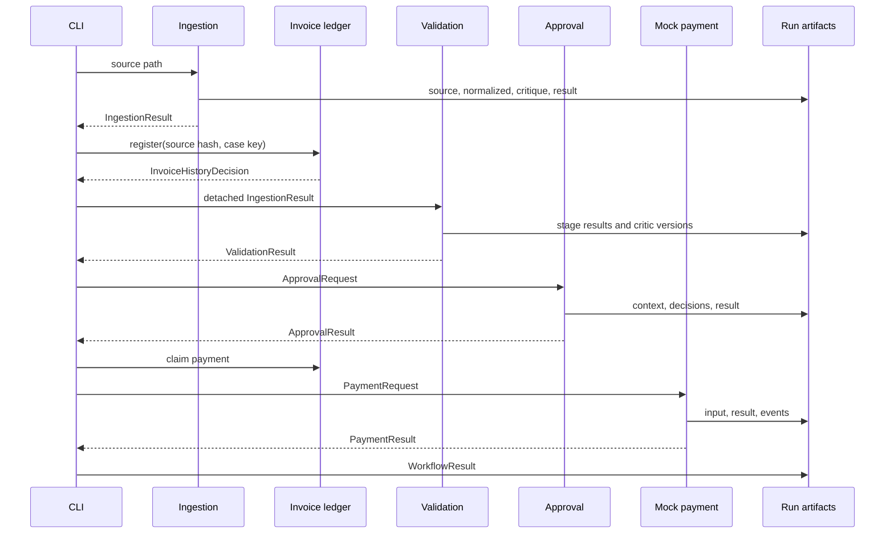

# State And Data Flow

The source document is immutable. Normalized claims can be revised, but revisions do not rewrite source chunks. Validation detaches its input by JSON round-trip to stop stage code from mutating the caller's ingestion object. Each reached stage contributes to a shared run directory, and the terminal workflow result is the presentation summary.

The ledger is deliberately separate from inventory. Inventory answers whether a requested product can be fulfilled. The ledger answers whether this business invoice version has already been seen, paid, claimed, or superseded. The dashboard reads the terminal summary and evaluation summaries rather than recomputing stage decisions.

The workflow retains partial results on terminal stops. For example, a validation denial contains ingestion and validation data but no approval or payment result. This makes a stop explainable without implying that later stages ran.
