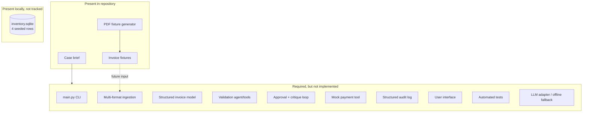
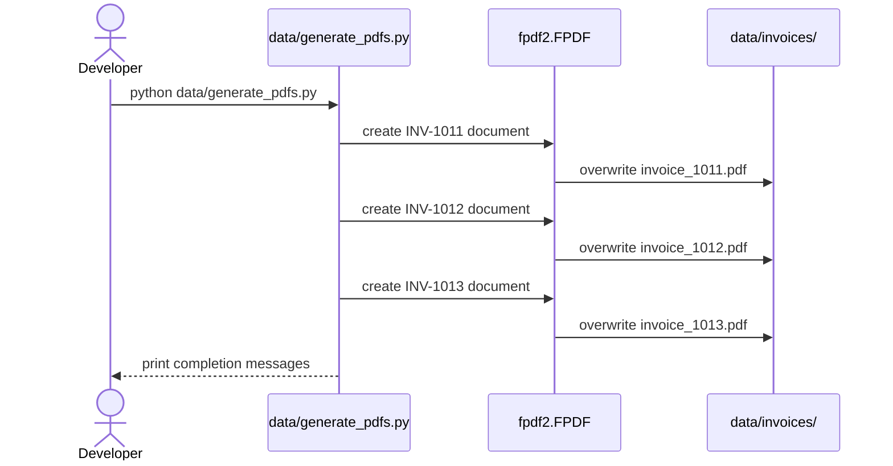

# Current System

## Baseline

This repository does not yet contain an invoice-processing system. It contains the inputs and problem definition from which one can be built. The distinction matters: the four workflow stages described in the case are requirements, not current runtime behavior.

The repository is on branch `main`. At the documented baseline, the local branch tracks `origin/main` and the latest commit is `2f15015` (`docs: simplify submission line`).

## Repository inventory

```text
galatiq-case-invoices/
├── README.md                  # Case brief and requested behavior
├── inventory.sqlite           # Local seeded DB; currently untracked
├── data/
│   ├── generate_pdfs.py       # Optional PDF-fixture generator
│   └── invoices/              # 20 fixture files, 16 invoice numbers
│       ├── invoice_1001.txt
│       ├── ...
│       └── invoice_1016.json
└── docs/                      # Repository documentation
```

The 20 fixture files comprise:

| Format | Count | Notes |
|---|---:|---|
| TXT | 7 | Structured, abbreviated, email-like, and OCR-like text |
| JSON | 6 | Includes the original and revised forms of `INV-1004` |
| CSV | 3 | Both key/value and tabular layouts |
| PDF | 3 | Alternate forms of `INV-1011`, `INV-1012`, and `INV-1013` |
| XML | 1 | A EUR-denominated invoice |

There are 16 unique invoice numbers. Multiple representations and one revision account for the difference between 16 logical invoices and 20 files.

## What works today

The only executable module is `data/generate_pdfs.py`. When its optional dependency is installed, it creates or overwrites:

- `data/invoices/invoice_1011.pdf`
- `data/invoices/invoice_1012.pdf`
- `data/invoices/invoice_1013.pdf`

The source fixtures can be opened directly by programs appropriate to their formats. Nothing in this repository currently parses them into a common model.

## What is specified but absent



Specifically, there is no:

- `main.py` even though the README shows `python main.py --invoice_path=...`;
- Python package or reusable domain model;
- `requirements.txt`, `pyproject.toml`, lockfile, or environment template;
- checked-in inventory database or script/migration that initializes it (the local workspace currently has an untracked, correctly seeded `inventory.sqlite`, but it is not yet reproducible from repository code);
- parser for TXT, JSON, CSV, XML, or PDF;
- validation, approval, reflection, payment, or rejection implementation;
- API server, web interface, or desktop interface;
- test directory, CI configuration, linting configuration, or coverage setup;
- output directory, run state, payment ledger, or audit schema;
- `.gitignore` or license file.

## Current data flow

There is no end-to-end processing flow yet. The sole implemented flow is fixture generation:



## Constraints inherited from the brief

- Runtime should work without internet access, despite the optional Grok integration.
- The required validation store is local SQLite.
- Payment must be simulated rather than sent to a real bank.
- Inputs are untrusted: malformed, incomplete, inconsistent, duplicate, and suspicious cases are intentional.
- The output is expected to include structured logs and results.
- The final deliverable must be a working prototype, not only architecture documentation.

## Known baseline caveats

- The repository Markdown and fixtures are UTF-8; tools that assume a legacy Windows code page can display punctuation such as em dashes incorrectly.
- The README's example path `data/invoices/invoice1.txt` does not exist; actual names follow `invoice_1001.txt` through `invoice_1016.json` with gaps by format.
- The local `inventory.sqlite` has the starter `inventory(item TEXT PRIMARY KEY, stock INTEGER)` schema and four expected rows. There is still no checked-in initializer; running the README snippet repeatedly without conflict handling would fail after the first insert.
- Regenerating PDFs is a write operation and replaces the three existing files.
- `invoice_1013.pdf` intentionally emits a grand total with an unexplained extra `$50`; the JSON fixture contains the same declared-total discrepancy. See [Invoice corpus](invoice-corpus.md).
