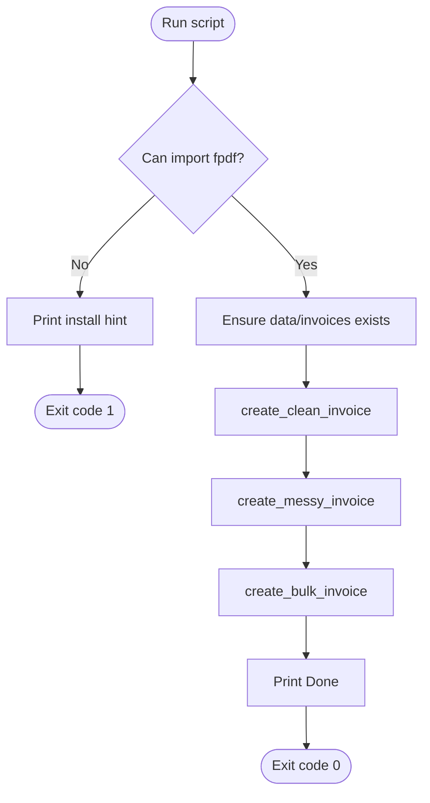
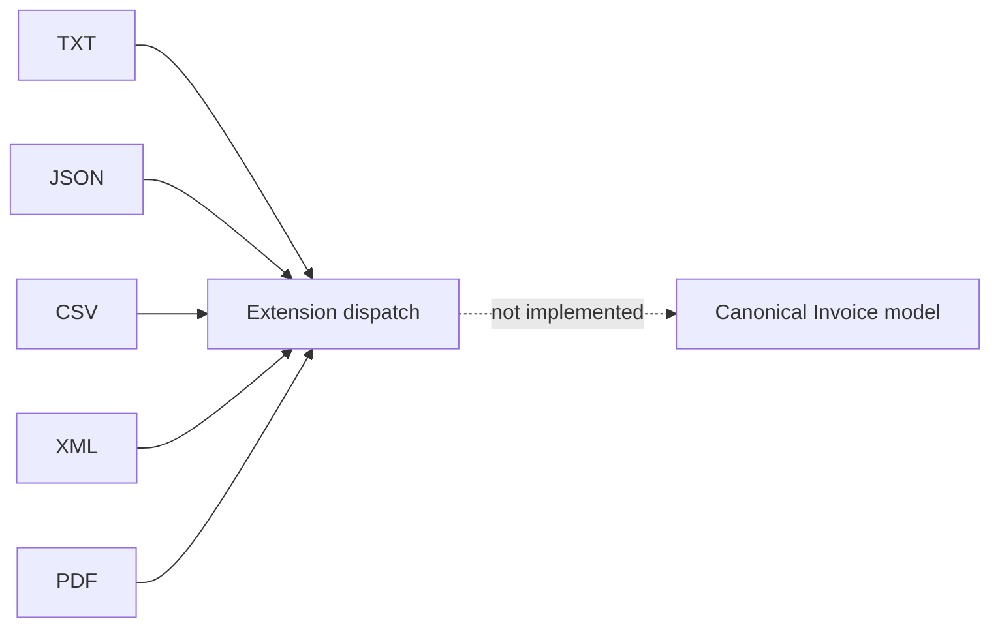
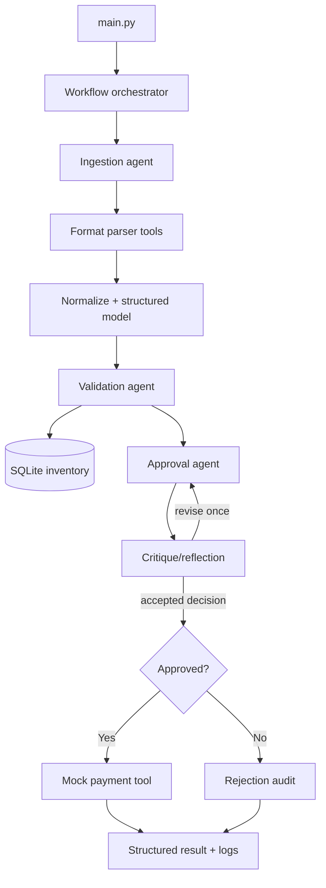

# Entry Points

An entry point is any supported place where execution or data ingestion begins. The workspace-level orchestrator now exists, while its application workflow dependency is still planned.

## Entry-point map

| Entry point | Status | Invocation / caller | Result |
|---|---|---|---|
| `data/generate_pdfs.py` | Present | `python data/generate_pdfs.py` | Regenerates three PDF fixtures |
| `data/generate_pdfs.py:create_clean_invoice()` | Present, internal | Called by the module guard | Writes `invoice_1011.pdf` |
| `data/generate_pdfs.py:create_messy_invoice()` | Present, internal | Called by the module guard | Writes `invoice_1012.pdf` |
| `data/generate_pdfs.py:create_bulk_invoice()` | Present, internal | Called by the module guard | Writes `invoice_1013.pdf` |
| Files in `data/invoices/` | Present data boundary | Future parser or manual inspection | Raw invoice content |
| `../main.py --invoice_path=...` | Present orchestrator shell | Shell/user | Regenerates PDFs, resolves inputs, and delegates to the planned workflow |
| Grok/xAI API | Specified, absent and optional | Future LLM adapter | Intended reasoning/structured output |
| SQLite `inventory.sqlite` | Present locally, untracked | Future validation tool | Seeded stock truth; no application currently calls it |
| `mock_payment(vendor, amount)` | Specified as a snippet, absent | Future payment stage | Intended simulated payment result |
| UI | Evaluation expectation, absent | Human reviewer/operator | Intended understandable workflow |

## The real executable path

`data/generate_pdfs.py` has a standard `if __name__ == "__main__"` module guard. Its control flow is:



Requirements and side effects:

- Requires the third-party distribution `fpdf2`, imported as `fpdf`.
- Resolves the output directory relative to the script, so it is independent of the caller's working directory.
- Creates the output directory if missing.
- Replaces existing PDFs with the same three names without prompting.
- Does not read the TXT/JSON versions to generate the PDFs; invoice values are duplicated in Python source.
- Does not accept command-line arguments.

## Data entry points

The fixtures form five parsing boundaries:



Extension dispatch alone is insufficient:

- TXT ranges from regular labels to email prose, abbreviations, misspellings, and OCR-like substitutions.
- CSV has two incompatible shapes: a vertical `field,value` stream and a conventional line-item table.
- JSON includes nested objects, optional fields, revisions, and invalid values.
- XML introduces a distinct hierarchy and a non-USD currency.
- PDF includes clean layout, OCR-like content, and repeated line items.

## CLI contract

The README proposes:

```bash
python ../main.py --invoice_path data/invoices/invoice_1001.txt --skip-pdf-generation
```

When no `--invoice_path` is supplied, the orchestrator regenerates and selects
the three PDF fixtures. Relative invoice paths are resolved from the repository
root. PDF generation can be bypassed when working with existing fixtures:

```bash
python ../main.py --invoice_path data/invoices/invoice_1001.txt --skip-pdf-generation
```

The CLI currently stops at its explicit workflow import boundary because
`src/invoice_system/workflow.py` has not been implemented. See the
[ingestion pipeline plan](ingestion-pipeline-plan.md) for the next slice.

A recommended exit-code contract is:

| Code | Meaning |
|---:|---|
| `0` | Processing completed, including a business rejection |
| `2` | Invalid CLI usage or unsupported file type |
| `3` | Invoice could not be extracted into the minimum schema |
| `4` | Internal/infrastructure failure |

A rejected invoice is a successful workflow outcome, not a process crash. Machine-readable output should carry the business disposition (`paid`, `rejected`, `needs_review`, or `failed`).

## Proposed runtime call graph

This graph is a design target, not current code:



See [Target architecture](target-architecture.md) for responsibilities and state transitions.
