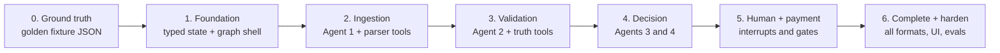
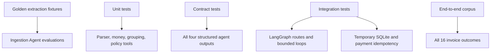

# Implementation Roadmap

This roadmap treats the four-agent LangGraph workflow as the product architecture from the beginning. Deterministic tools are built alongside the agents that use them, rather than as a separate non-agent application.

The agent boundaries and handoff requirements in [Agent contracts](agent-contracts.md) are the source of truth during implementation.

## Build order

## Milestone 0: Establish ground truth

Before grading an LLM, define the expected extraction independently of it.

- Create a reviewed expected JSON fixture for each logical invoice.
- Store both literal source values and expected normalized values.
- Mark which corrections are safe, ambiguous, or forbidden.
- Record expected arithmetic, inventory, and policy findings separately from extraction expectations.
- Define extraction metrics: field accuracy, line-item accuracy, unsupported claims, and ambiguity detection.

Exit condition: at least `INV-1001`, `INV-1009`, `INV-1012`, and `INV-1013` have human-reviewed golden results covering clean, invalid, OCR-like, and repeated-line cases.

## Milestone 1: Foundation and graph shell

- Add `pyproject.toml`, supported Python version, dependencies, and `.gitignore`.
- Define Pydantic models for raw extraction, normalized invoice, transformation, finding, decision, critique, human review, payment, and shared graph state.
- Define stable status vocabulary and validation codes.
- Create the LangGraph nodes and conditional edges with placeholder agent implementations.
- Add counters for ingestion attempts, validation tool calls, and approval revisions.
- Add structured audit events for every node transition and tool call.

Exit condition: a test state can traverse the graph, every route terminates, and state serializes to stable JSON.

## Milestone 2: Ingestion Agent

- Implement JSON parsing first, then connect it as an Ingestion Agent tool.
- Give the agent a structured-output contract that returns raw extraction, normalized invoice, transformations, confidence, and issues.
- Implement controlled item aliases without fuzzy replacement of unknown products.
- Add schema-feedback retry with a strict maximum.
- Evaluate the agent against the golden fixture rather than accepting plausible-looking output.

Start with:

- `INV-1004`: clean nested JSON;
- `INV-1009`: missing and invalid values that must not be silently repaired;
- `INV-1013`: repeated rows and a declared-total discrepancy that ingestion must preserve.

Exit condition: Agent 1 produces schema-valid, evidence-preserving results for the initial JSON fixtures and escalates unresolved fields without hallucinating replacements.

## Milestone 3: Validation ReAct Agent

- Add deterministic consolidation and `Decimal` arithmetic tools.
- Add an idempotent inventory initialization script.
- Wrap SQLite behind `get_inventory(item_names)`; never expose arbitrary SQL to the agent.
- Implement deterministic business-rule evaluation with versioned rules.
- Give Agent 2 bounded ReAct behavior and require a complete checklist of performed/skipped checks.
- Implement a targeted re-ingestion request with a one-retry maximum.
- Continue validation after individual failures so all findings are returned.

Exit condition: Agent 2 discovers every expected `INV-1013` finding through tools, cites the returned evidence, and terminates within its tool-call budget.

## Milestone 4: Approval and Critic Agents

- Give Agent 3 the invoice, extraction issues, complete validation report, and policy output.
- Require one of `approved`, `rejected`, or `needs_review`, with reasons mapped to finding codes.
- Implement Agent 4 as an independent critic that checks completeness, evidence, policy consistency, and payment authorization.
- Allow one Approval Agent revision from critic feedback.
- Route unresolved disagreement to human review.
- Test deliberate bad decisions: ignored findings, invented evidence, approval with blocking findings, and rejection of mere uncertainty.

Exit condition: Agents 3 and 4 reject `INV-1013` for the documented evidence, while a clean invoice can reach an accepted approval decision.

## Milestone 5: Human review and payment

- Add a persistent LangGraph checkpointer and interrupt for `needs_review`.
- Build a small review UI showing the original, raw/normalized values, transformations, findings, evidence, proposed decision, and critic response.
- Support structured actions: approve, reject, correct and revalidate.
- Require identity/time/reason for human overrides.
- Add an idempotent mock-payment ledger and an independent authorization gate.
- Ensure rejected and review-pending states cannot reach payment.

Exit condition: a review can pause and resume after process restart, and replaying an approved invoice cannot create a second payment.

## Milestone 6: Complete formats and harden

- Add both CSV shapes, XML, ordinary TXT, email-like TXT, OCR-like TXT, and PDF extraction.
- Verify equivalent canonical data for the `INV-1011`, `INV-1012`, and `INV-1013` alternate representations.
- Implement revision/duplicate handling for `INV-1004`.
- Add optional xAI/Grok configuration with timeouts and an offline test double/fallback.
- Add CLI and UI observability using the same graph.
- Add CI for formatting, linting, type checking, unit tests, integration tests, graph-route tests, and agent evaluations.

Exit condition: every supplied fixture completes as approved, rejected, or review-required without an unhandled exception, and all agent behavior is measured against golden expectations.

## Test layers

Tests must make failures attributable. A wrong result should reveal whether extraction, normalization, a deterministic tool, validation reasoning, approval, critique, routing, or payment caused it.

Minimum high-value assertions:

- raw source values survive normalization;
- safe aliases are recorded, not hidden;
- unknown products are never fuzzy-corrected into known products;
- `INV-1009`'s negative quantity is not changed to positive;
- `INV-1007` reports the `$110` total variance;
- `INV-1013` aggregates repeated rows and reports its `$50` variance and all stock failures;
- the Validation Agent does not stop after the first finding;
- re-ingestion occurs only for evidence-backed extraction doubt and at most once;
- the Critic catches a deliberately omitted finding;
- approval revision occurs at most once;
- human-review state is resumable;
- payment requires authorization and is idempotent.

Use a temporary SQLite database per test. Never mutate shared invoice fixtures during tests.

## First vertical slice

The first working demonstration should process two JSON invoices through all four agents:

1. `INV-1004` exercises the successful route;
2. `INV-1013` exercises consolidation, database tools, multiple findings, approval rejection, and critique.

The slice includes:

- typed shared state and graph routing;
- four minimally capable agents with structured outputs;
- JSON reader, grouping, arithmetic, policy, and inventory tools;
- one bounded approval/critic revision path;
- audit output;
- idempotent mock payment for the approved route;
- deterministic tests and golden extraction evaluation.

This is narrow enough to build quickly while proving the actual multi-agent architecture rather than postponing it.

## Definition of done

- The four agents have distinct prompts, tools, contracts, and tests.
- Agent loops and retries have explicit, tested limits.
- All five input formats are supported.
- All 16 logical invoices have expected extraction and outcome fixtures.
- Validation findings contain source/tool evidence.
- Human review can pause, inspect, correct, and resume a run.
- Grok is optional at runtime; automated tests are network-independent.
- Payment is mock-only, gated, audited, and idempotent.
- The CLI and UI invoke the same graph and business logic.
- A reviewer can explain every decision from the persisted audit without reading model chain-of-thought.
