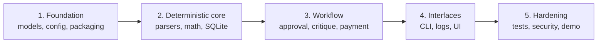
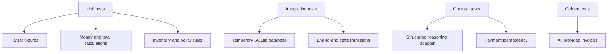

# Implementation Roadmap

This sequence gets to a reliable local vertical slice early, then adds agentic behavior and presentation without hiding core correctness behind an LLM.

## Build order

### Milestone 1: Foundation

- Add `pyproject.toml`, supported Python version, locked/runtime dependencies, and `.gitignore`.
- Define typed models for invoice, line item, finding, decision, payment, and workflow state.
- Add configuration for inventory path, output path, approval threshold, offline mode, and optional xAI credentials.
- Decide and document status vocabulary and stable validation codes.

Exit condition: models reject invalid types and serialize to a stable JSON result.

### Milestone 2: Deterministic vertical slice

- Implement JSON parsing first with `INV-1004`.
- Add an idempotent database initialization script using upserts or `INSERT OR REPLACE`.
- Implement inventory lookup, item aggregation, arithmetic validation, and basic approval rules.
- Add an idempotent mock payment ledger.
- Connect one invoice end to end through the CLI.

Exit condition: `INV-1004` produces a repeatable approved/payment result and rerunning it does not create a second payment.

### Milestone 3: All formats and edge cases

- Add both CSV layouts, XML, regular TXT, email-like TXT, OCR-like TXT, and PDF extraction.
- Add controlled item aliases and parser confidence/issues.
- Implement duplicate/revision selection for `INV-1004`.
- Verify equivalent canonical results for `INV-1011`, `INV-1012`, and `INV-1013` alternate formats.

Exit condition: every fixture parses or returns an intentional, structured `needs_review` result—never an unhandled exception.

### Milestone 4: Agent reasoning

- Define a provider-neutral reasoning interface.
- Add xAI/Grok behind configuration, with timeouts and schema validation.
- Provide a deterministic local fallback so the prototype works offline.
- Implement a bounded approval/critic exchange with explicit evidence.
- Record model/provider metadata without recording secrets.

Exit condition: the same validation findings feed both online and offline decision modes, and the critic loop always terminates.

### Milestone 5: UX and operations

- Add a small UI that displays the source, extracted fields, findings, decision reasons, and payment status.
- Add structured JSON logs with `run_id`, `invoice_number`, stage, duration, and outcome.
- Provide a demo command, screenshots, and a concise architecture/decision record.
- Add CI for formatting, linting, type checking, tests, and a smoke run.

Exit condition: a reviewer can process a sample invoice and understand every decision without reading source code.

## Test strategy

Minimum high-value assertions:

- `INV-1001` passes stock and arithmetic checks.
- `INV-1002`, `INV-1005`, and `INV-1007` report insufficient stock.
- `INV-1003` reports zero stock, suspicious signals, invalid relative date, and high-value scrutiny.
- `INV-1008` and `INV-1016` report unknown products.
- `INV-1009` is blocked for missing and invalid data.
- `INV-1007` reports the `$110` total variance.
- `INV-1013` aggregates repeated lines and reports the `$50` total variance.
- `INV-1014` preserves EUR and follows explicit currency policy.
- Alternate representations normalize to equivalent invoice data.
- Reprocessing an already paid invoice returns the existing payment outcome.

Use a temporary SQLite database per test. Do not mutate the shared fixture directory during tests.

## Definition of done

- One documented setup command creates a reproducible environment.
- One documented initialization command creates the local database safely on repeated runs.
- The README's CLI example is real and exercised in CI.
- All five formats are supported.
- All 16 logical invoices have expected outcomes captured as tests.
- Validation evidence and approval reasoning are visible in structured output.
- The workflow runs without network access; Grok is optional enhancement, not a hard dependency.
- Payment is mock-only and idempotent.
- Failures have actionable messages and nonzero process exit codes only for technical failures.
- The UI and CLI expose the same workflow rather than duplicating business logic.

## First practical slice

The smallest useful implementation is:

1. canonical models;
2. JSON parser;
3. idempotent inventory setup;
4. deterministic validation and approval policy;
5. mock payment ledger;
6. CLI plus JSON output;
7. tests for `INV-1004`, `INV-1005`, `INV-1009`, and `INV-1016`.

That slice covers success, insufficient stock/high value, malformed data, and an unknown item before taking on ambiguous text or PDF extraction.
