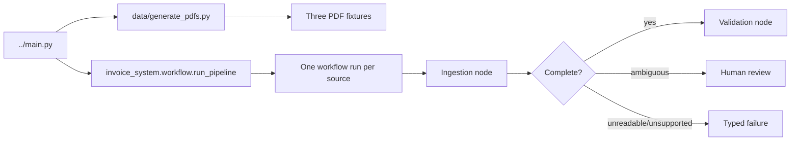

# Ingestion Pipeline Plan

This plan turns the [agent contract](agent-contracts.md) into an implementation
sequence. The first executable boundary is the workspace-level `../main.py`.
It regenerates PDF fixtures, selects source documents, and delegates to
`invoice_system.workflow.run_pipeline`. Parsing and agent logic do not belong in
the CLI.

## Initial call path

Batch input is only a CLI convenience. Each document receives its own `run_id`,
state, retry counters, audit trail, and terminal result. A failure in one input
must not erase the results for the others.

## Ingestion layers

Keep the ingestion agent small by separating deterministic document work from
judgment:

1. **Source intake** validates that the path is a regular supported file,
   computes SHA-256, records byte size, detects a content type, and creates a
   source record before parsing.
2. **Format readers** return source-faithful content from JSON, CSV, XML, TXT,
   or PDF. They never normalize business values.
3. **Candidate parsers** map reader output into raw fields and line items with
   evidence locators such as JSON paths, CSV rows, XML paths, text line ranges,
   or PDF page and bounding-box data.
4. **The ingestion agent** resolves only genuine interpretation choices. It can
   select parser evidence, apply controlled aliases, propose uncertain OCR
   corrections, and request one schema-guided retry.
5. **Schema and completeness gates** validate structure independently from
   business validity. Negative quantities can be structurally valid and must be
   preserved for validation rather than repaired during ingestion.

## First models

Implement these Pydantic models before adding prompts:

- `SourceDocument`: path, hash, size, extension, detected media type;
- `Evidence`: source hash, reader, locator, literal value, optional text excerpt;
- `RawField` and `RawLineItem`: literal values plus evidence;
- `Transformation`: field path, source value, normalized value, rule, confidence;
- `ExtractionIssue`: stable code, field path, severity, evidence, suggested action;
- `Invoice` and `LineItem`: normalized candidate using `Decimal` for money;
- `IngestionResult`: raw extraction, candidate, transformations, issues,
  structural validity, minimum completeness, and attempt count.

The normalized invoice should allow missing optional/required values while
ingestion is in progress. A separate completeness result should list which
required fields are absent. Otherwise, a strict model makes it impossible to
represent the intentionally incomplete `INV-1009` without inventing values.

## Stable ingestion issue codes

Start with a small vocabulary:

| Code | Meaning | Route |
|---|---|---|
| `UNSUPPORTED_FORMAT` | No permitted reader can handle the source | failed |
| `UNREADABLE_SOURCE` | Reader could not obtain usable content | review or failed |
| `MISSING_REQUIRED_FIELD` | A required value is absent | review |
| `AMBIGUOUS_VALUE` | More than one interpretation remains plausible | review |
| `LOW_CONFIDENCE_OCR` | OCR correction is below the configured threshold | review |
| `INVALID_FIELD_SYNTAX` | A value cannot be parsed into its target type | review |
| `SCHEMA_INVALID` | Agent output violates the structured-output contract | bounded retry |

Business findings such as negative quantity, total mismatch, unknown item, or
insufficient stock belong to validation, not this list.

## Security and reliability rules

- Treat all invoice text as untrusted data, never as prompt instructions.
- Limit file size, PDF page count, extracted text length, and OCR runtime.
- Validate detected content against the extension; do not dispatch on extension
  alone.
- Use hardened XML parsing and disable external entities.
- Never log full documents by default; audit hashes, locators, and the minimum
  evidence needed to explain a result.
- Set `ingestion_attempts` before entering the agent and enforce the retry limit
  in graph routing, not only in the prompt.
- Cache deterministic reader output by source hash so a targeted recheck does
  not repeat expensive extraction.

## Build slices

### Slice 1: JSON contract

- Add the package skeleton, Pydantic models, workflow entry point, and one-run-
  per-document batch wrapper.
- Parse `INV-1004`, `INV-1009`, and `INV-1013` deterministically.
- Preserve every source value and evidence path.
- Test clean, incomplete/invalid, and repeated-row cases without an LLM.

### Slice 2: Agent interpretation

- Add a provider-independent structured-output adapter and offline test double.
- Give the agent only reader output, controlled aliases, schema validation, and
  a bounded correction loop.
- Add prompt-injection and unsupported-claim evaluations.

### Slice 3: PDF parity

- Add local PDF text/layout extraction, then OCR only when the text layer is
  absent or unusable.
- Compare `INV-1011`, `INV-1012`, and `INV-1013` PDFs with their equivalent
  TXT/JSON fixtures.
- Route uncertain OCR corrections to review instead of silently changing them.

### Slice 4: Remaining formats and graph handoff

- Add the two CSV shapes, XML, ordinary TXT, email-like TXT, and OCR-like TXT.
- Connect complete ingestion results to validation through typed graph state.
- Persist audit events for intake, reader calls, transformations, retries, and
  terminal routing.

## Contract decisions to make explicit

The current agent contracts provide good responsibility boundaries, but these
details should be resolved in code and then reflected back into the contract:

- structural schema validity versus minimum extraction completeness;
- exact required fields and whether currency defaults are ever permitted;
- confidence scale, per-field thresholds, and aggregation rules;
- evidence locator format for each file type;
- review-versus-failure routing for unreadable documents;
- supported file-size/page limits and encrypted PDF behavior;
- whether duplicate source hashes are stopped at intake or passed to validation;
- batch result and partial-failure semantics.

## First acceptance target

The first mergeable ingestion milestone is complete when running one JSON file
through `run_pipeline` produces a JSON-serializable `IngestionResult`, the raw
values can be traced to source locators, `INV-1009` remains invalid without being
silently repaired, retries are bounded, and the graph either hands a complete
candidate to validation or returns a typed review/failure state.
