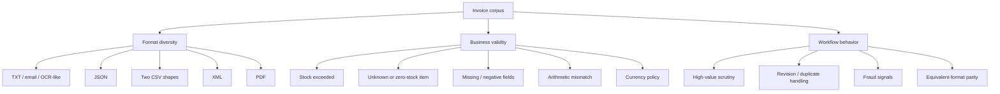
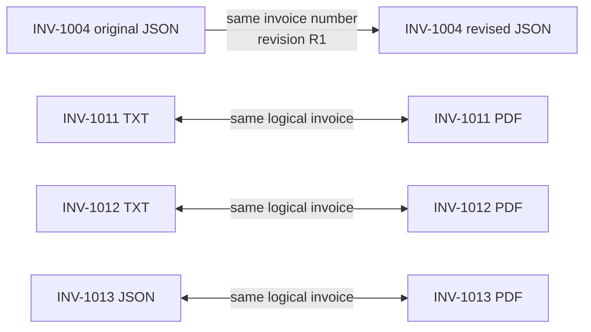

# Invoice Corpus

The fixtures are the effective acceptance-test specification. They exercise format variation, extraction ambiguity, arithmetic validation, inventory checks, duplicate/version handling, policy review, and fraud signals.

The starter inventory in the README is:

| Item | Available stock |
|---|---:|
| `WidgetA` | 15 |
| `WidgetB` | 10 |
| `GadgetX` | 5 |
| `FakeItem` | 0 |

“Expected signal” below describes what a robust implementation should detect; no current code performs these checks.

## Fixture matrix

| Invoice | Artifact(s) | Amount | Key scenario and expected signal |
|---|---|---:|---|
| `INV-1001` | TXT | $5,000.00 | Clean baseline; both quantities are within stock. |
| `INV-1002` | TXT | $15,000.00 | Misspelled/abbreviated labels; `GadgetX` 20 exceeds stock 5; date and due date are the same despite Net 30; amount exceeds $10K. |
| `INV-1003` | TXT | $100,000.00 | `FakeItem` has zero stock; relative due date `yesterday`; urgency/wire language; unknown/high-risk vendor; high-value review. |
| `INV-1004` | JSON + revised JSON | $1,890.00 / $5,940.00 | Original and revision share an invoice number. Both fit per-item stock; processor must avoid treating both versions as independent payable invoices. |
| `INV-1005` | JSON | $15,225.00 | `GadgetX` 8 exceeds stock 5; total exceeds $10K; other quantities fit. |
| `INV-1006` | key/value CSV | $2,750.00 | Clean data in a non-tabular repeating-field CSV representation. |
| `INV-1007` | tabular CSV | $15,525.00 declared | `WidgetA` 20 and `WidgetB` 15 exceed stock; subtotal + 6% tax equals $15,635, not the declared $15,525; high-value review. |
| `INV-1008` | TXT/email | $9,900.00 | `SuperGizmo` and `MegaSprocket` are absent from inventory; embedded in email prose. |
| `INV-1009` | JSON | -$250.00 | Missing vendor and due date, negative quantity, blank terms, and inconsistent subtotal semantics. Must fail integrity validation. |
| `INV-1010` | TXT | $7,185.00 | Duplicate `WidgetA` descriptions, rush surcharge, tax and shipping; aggregate `WidgetA` quantity is 12 and fits stock. |
| `INV-1011` | TXT + PDF | $3,000.00 | Clean equivalent representations; useful for parser parity checks. |
| `INV-1012` | TXT + PDF | $9,975.00 | OCR-like `2O26` and `$3,500.O0`, item-name spacing, misspellings, and former vendor name; quantities still fit stock. |
| `INV-1013` | JSON + PDF | $22,562.80 declared | Repeated item rows aggregate beyond all three stock limits; computed subtotal + tax is $22,512.80, leaving an unexplained $50 discrepancy; high-value review. |
| `INV-1014` | XML | EUR 4,125.00 | XML parsing and non-USD currency policy; quantities fit stock. |
| `INV-1015` | tabular CSV | $6,500.00 | Clean tabular CSV; quantities fit stock. |
| `INV-1016` | JSON | $3,233.00 | `WidgetC` is absent from inventory; known items fit. |

## Coverage map



## Important aggregation rules

Stock should be checked after normalizing and aggregating equivalent item names within an invoice. Otherwise repeated rows can evade the limit.

| Invoice | Normalized aggregate |
|---|---|
| `INV-1010` | `WidgetA = 12`, `WidgetB = 4`, `GadgetX = 2` |
| `INV-1012` | `WidgetA = 12`, `WidgetB = 7`, `GadgetX = 4` after removing spaces |
| `INV-1013` | `WidgetA = 22`, `WidgetB = 18`, `GadgetX = 9` |

Normalization must be controlled. A deterministic alias table can safely map `Widget A` to `WidgetA` and `Gadget X` to `GadgetX`; fuzzy matching should produce a review signal rather than silently changing an unknown product.

## Arithmetic rules

For every line and invoice, retain both the declared and computed values:

```text
computed_line_amount = quantity × unit_price
computed_subtotal    = sum(computed_line_amount)
computed_total       = computed_subtotal + tax + shipping + explicit_fees
variance             = declared_total - computed_total
```

Never overwrite source values during normalization. Storing both values makes discrepancies explainable and auditable.

Known intentional discrepancies include:

- `INV-1007`: `$14,750 + $885 = $15,635`, but the declared total is `$15,525` (variance `-$110`).
- `INV-1013`: `$21,040 + $1,472.80 = $22,512.80`, but the declared total is `$22,562.80` (variance `+$50`).
- `INV-1009`: negative line arithmetic reaches `-$250`, while the declared subtotal is `$1,000`; negative quantity must be rejected before totals are trusted.

## Fixture relationships



Tests should assert equivalent canonical fields for the TXT/PDF and JSON/PDF pairs. The `INV-1004` pair instead tests version selection and idempotency.
