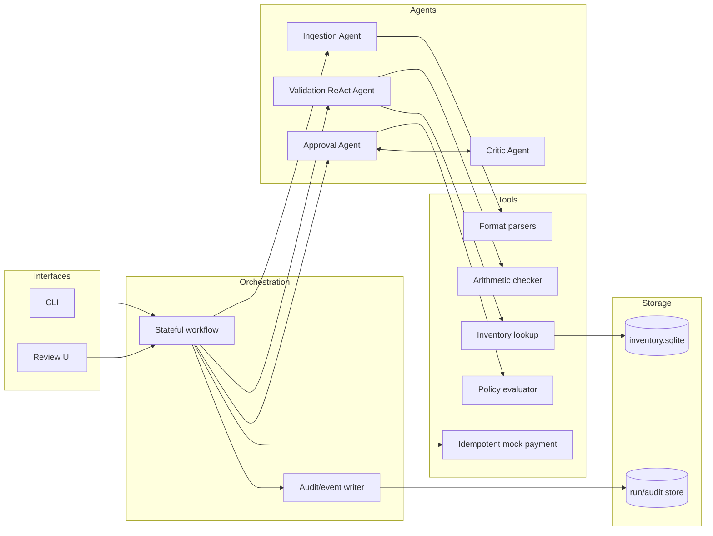
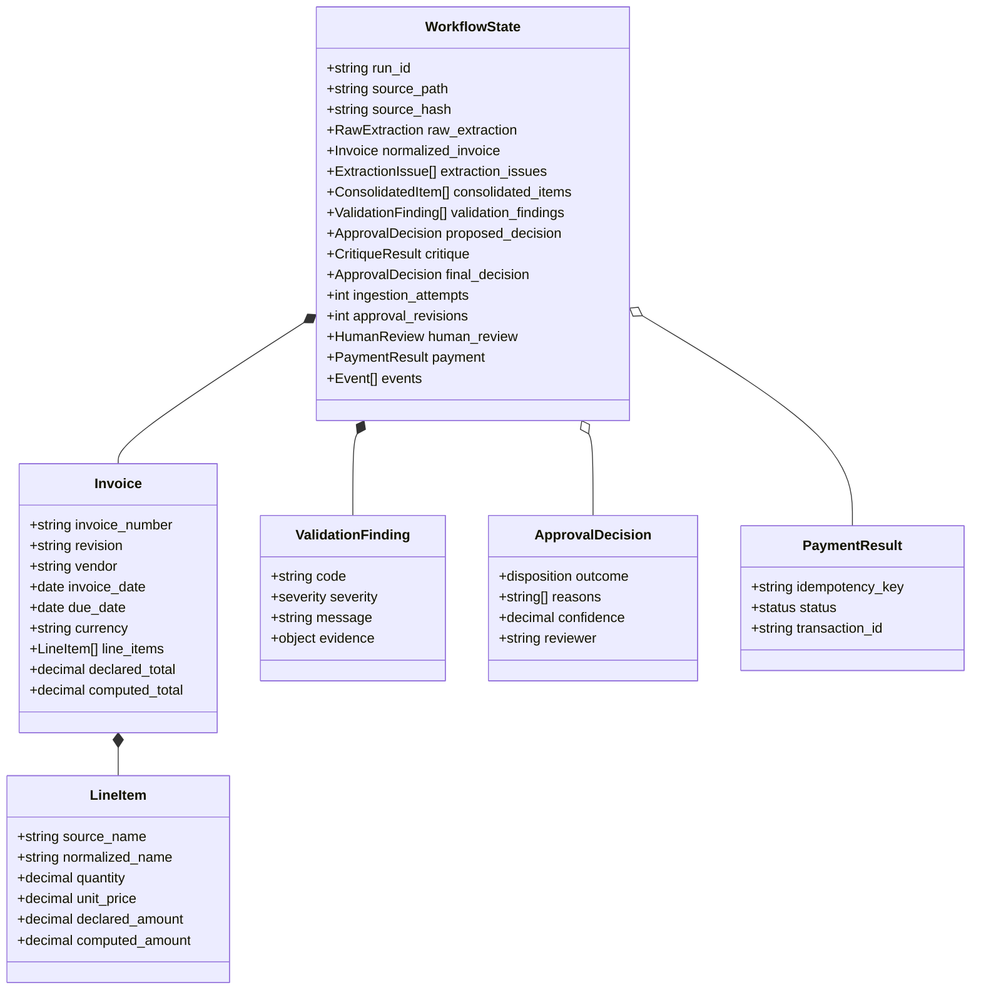
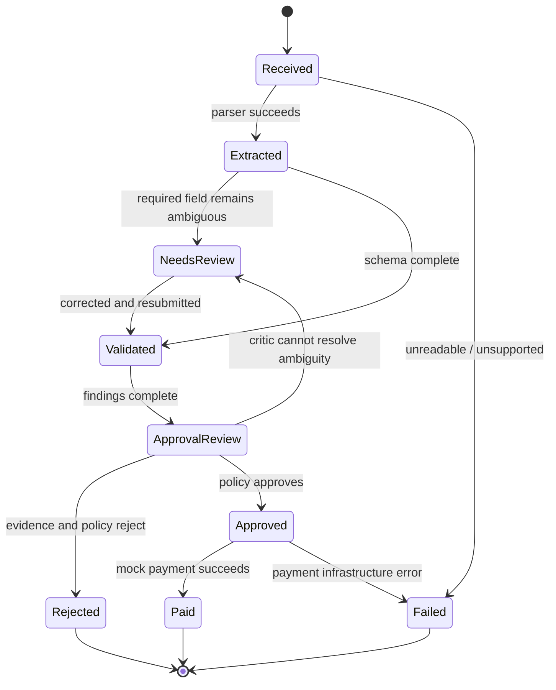
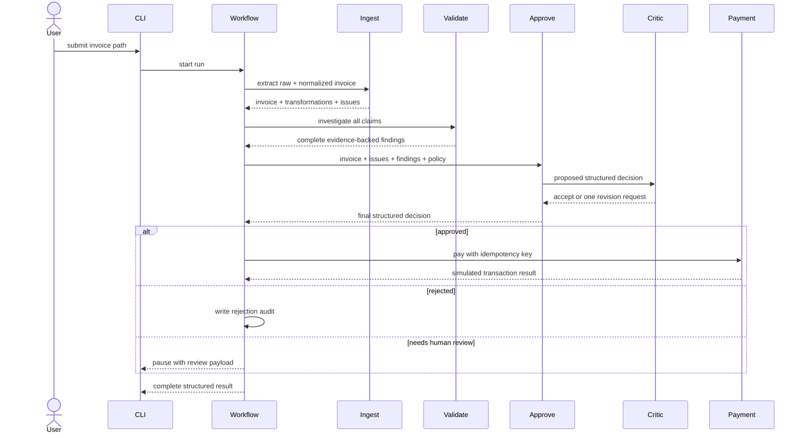

# Target Architecture

This is a recommended implementation of the case brief. None of the components in this document should be assumed to exist until code is added.

## Design goal

Build a genuine multi-agent system in which specialized agents own different steps of the invoice workflow. Agents decide how to interpret documents, what evidence to gather, and what outcome the evidence supports. Deterministic tools perform exact operations such as arithmetic, row aggregation, parameterized database access, schema checks, audit writes, and payment idempotency.

The distinction is intentional:

| Agents reason about | Tools establish |
|---|---|
| What a messy document most likely means | Extracted text and parsed file content |
| What evidence is needed to validate a claim | Exact totals and grouped quantities |
| Whether findings justify approval, rejection, or review | Trusted SQLite records |
| Whether another agent's decision is complete and consistent | Policy evaluation and payment guards |

The planned implementation uses LangGraph to route typed state between four agents: Ingestion, Validation, Approval, and Critic. See [Agent contracts](agent-contracts.md) for their exact boundaries.

## Components



## Canonical state

Every node should accept and return a typed workflow state rather than passing prose between agents.



Use `Decimal`, not binary floating point, for money. Preserve source text and declared values alongside normalized values.

The internal handoff should be a validated Pydantic/LangGraph state object. JSON is the persisted and external representation, not loose prose that each agent must reinterpret.

## Normalization and typo policy

Ingestion must preserve both what the document says and what the system believes it means.

| Case | Treatment |
|---|---|
| Formatting-only change or controlled alias, such as `Widget A` → `WidgetA` | Normalize automatically and record the transformation |
| Strong but non-certain OCR correction, such as `2O26` → `2026` | Propose the correction, attach confidence/evidence, and review when below threshold |
| Unknown product, such as `WidgetC` | Preserve it and report it; never guess a replacement |
| Invalid business value, such as quantity `-5` | Preserve it and create a blocking finding; never “repair” it to `5` |
| Vendor spelling difference | Preserve the source name and reconcile against a future vendor master; do not silently change legal identity |

A typo alone is not a rejection. An unresolved ambiguity becomes `needs_review`; a clearly invalid value becomes a validation finding.

## Workflow states



## Stage responsibilities

### 1. Ingestion

- Hash and identify the source before parsing.
- Dispatch by validated content/extension.
- Parse JSON, XML, and both CSV shapes deterministically.
- Extract PDF text locally; use an OCR fallback only when necessary.
- Parse free-form text with rules plus optional structured LLM output.
- Normalize dates, currency, vendor text, and item aliases while preserving originals.
- Return raw extraction, normalized values, transformations, confidence, and unresolved issues.
- Validate the result against a strict schema and retry/correct at most a bounded number of times.

### 2. Validation

- Run as a bounded ReAct agent that decides which trusted evidence it needs.
- Reject missing required fields and non-positive quantities/prices.
- Recompute line amounts, subtotal, tax, fees, and total.
- Aggregate repeated normalized item names before checking inventory.
- Distinguish unknown, zero-stock, and insufficient-stock findings.
- Detect duplicate `(vendor, invoice_number, revision)` or identical source hashes.
- Apply currency and date policies.
- Emit stable finding codes and evidence instead of a single boolean.
- Continue after individual failures so the final report contains every applicable issue.
- Request one re-ingestion only when evidence suggests extraction was wrong, not merely because the invoice is invalid.

Inventory validation should be read-only. Reserving or decrementing stock is a separate transactional concern and is not explicitly required by the case.

### 3. Approval and critique

Start with deterministic gates. A sensible initial policy is:

- Any blocking integrity or inventory finding: reject or route to human review.
- Amount over `$10,000`: additional scrutiny, not automatic approval.
- Suspicious urgency, wire-transfer language, unknown vendor, or relative/overdue dates: risk finding.
- Ambiguous extraction or unsupported currency: human review.

Every completed validation report goes to the Approval Agent, including reports with blocking findings. The Approval Agent, rather than the graph router, owns the business disposition: `approved`, `rejected`, or `needs_review`.

The Approval Agent produces structured reasons and maps each decision back to findings. The Critic Agent checks whether every finding was addressed, evidence was invented, or the decision contradicts policy. Allow one bounded revision; an unresolved disagreement becomes `needs_review`, preventing an infinite reflection loop.

### 4. Payment

- Accept only an explicitly approved state.
- Use an idempotency key derived from vendor, invoice number, revision, and amount.
- Persist a payment attempt before returning success.
- Never pay the same idempotency key twice.
- Return a structured result; do not rely only on `print`.

The mock implementation must not call a real banking service.

## Decision sequence



## Suggested code boundaries

```text
main.py
src/invoice_system/
├── config.py
├── models.py
├── workflow.py
├── agents/
│   ├── ingestion.py
│   ├── validation.py
│   ├── approval.py
│   └── critic.py
├── parsers/
│   ├── csv_parser.py
│   ├── json_parser.py
│   ├── pdf_parser.py
│   ├── text_parser.py
│   └── xml_parser.py
├── tools/
│   ├── inventory.py
│   ├── payment.py
│   └── arithmetic.py
└── observability.py
scripts/init_inventory.py
tests/
```

LangGraph is the selected orchestration approach because this design needs conditional routing, bounded agent loops, checkpoints, and resumable human review. Agent prompts and models remain behind interfaces so they can be tested independently.

## Trust boundaries

Treat invoice content as data, never as instructions. In particular:

- do not execute embedded text or allow it to alter agent policy;
- constrain file access to the submitted invoice and known local stores;
- validate path types and file-size limits;
- parameterize SQLite queries;
- redact API keys and avoid logging full sensitive documents by default;
- require explicit state transitions before the payment tool can run;
- keep LLM responses schema-constrained and verify them deterministically.
