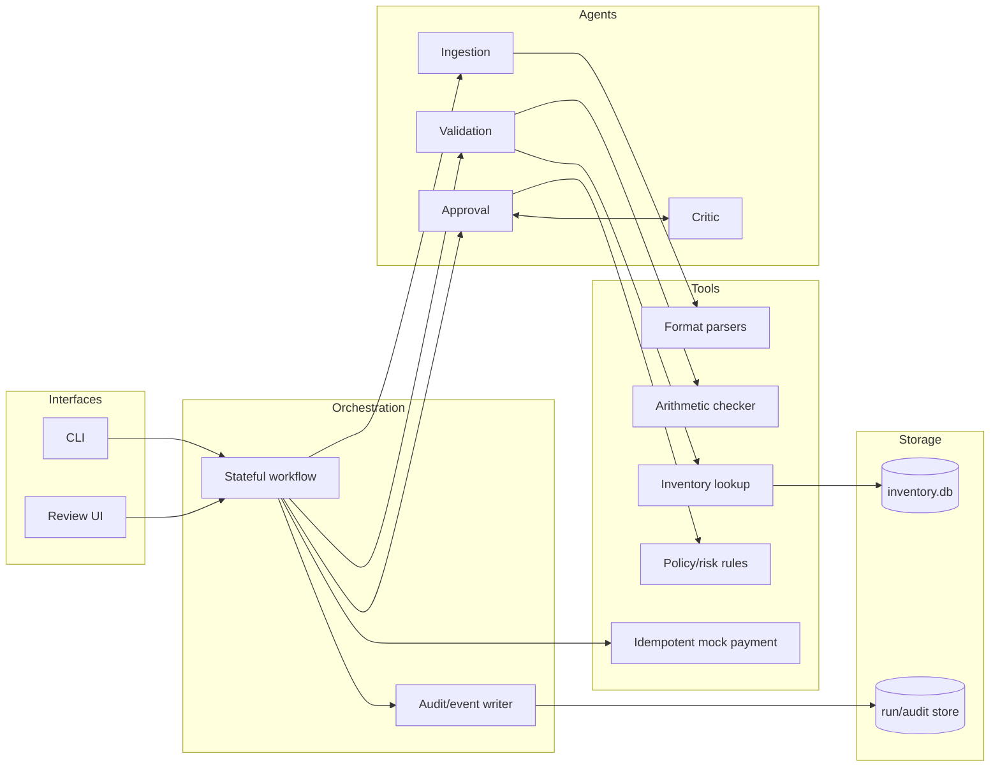
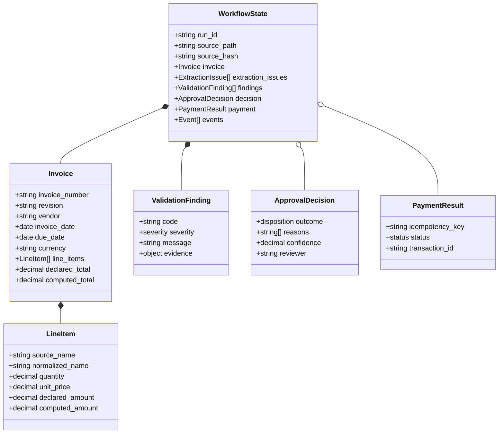
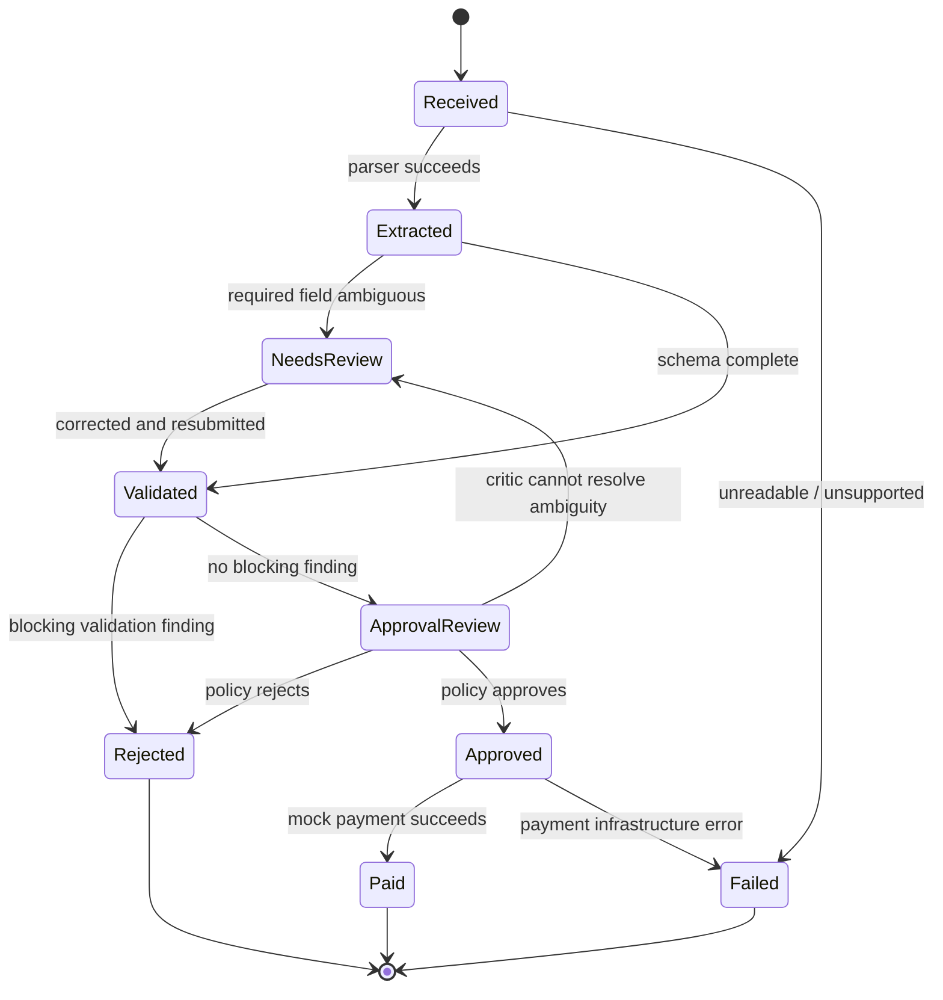
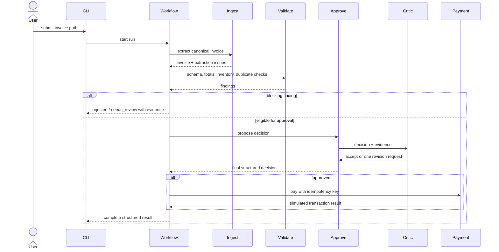

# Target Architecture

This is a recommended implementation of the case brief. None of the components in this document should be assumed to exist until code is added.

## Design goal

Use deterministic code for parsing known structured formats, arithmetic, database access, policy enforcement, and payments. Use an LLM only where ambiguity or explanation benefits from reasoning, behind an interface with an offline deterministic fallback. This keeps the required local prototype repeatable.

## Components



## Canonical state

Every node should accept and return a typed workflow state rather than passing prose between agents.



Use `Decimal`, not binary floating point, for money. Preserve source text and declared values alongside normalized values.

## Workflow states



## Stage responsibilities

### 1. Ingestion

- Hash and identify the source before parsing.
- Dispatch by validated content/extension.
- Parse JSON, XML, and both CSV shapes deterministically.
- Extract PDF text locally; use an OCR fallback only when necessary.
- Parse free-form text with rules plus optional structured LLM output.
- Normalize dates, currency, vendor text, and item aliases while preserving originals.
- Validate the result against a strict schema and retry/correct at most a bounded number of times.

### 2. Validation

- Reject missing required fields and non-positive quantities/prices.
- Recompute line amounts, subtotal, tax, fees, and total.
- Aggregate repeated normalized item names before checking inventory.
- Distinguish unknown, zero-stock, and insufficient-stock findings.
- Detect duplicate `(vendor, invoice_number, revision)` or identical source hashes.
- Apply currency and date policies.
- Emit stable finding codes and evidence instead of a single boolean.

Inventory validation should be read-only. Reserving or decrementing stock is a separate transactional concern and is not explicitly required by the case.

### 3. Approval and critique

Start with deterministic gates. A sensible initial policy is:

- Any blocking integrity or inventory finding: reject or route to human review.
- Amount over `$10,000`: additional scrutiny, not automatic approval.
- Suspicious urgency, wire-transfer language, unknown vendor, or relative/overdue dates: risk finding.
- Ambiguous extraction or unsupported currency: human review.

The approval agent produces structured reasons. The critic checks whether each finding was addressed and whether the decision contradicts policy. Allow one bounded revision; an unresolvable disagreement becomes `needs_review`, preventing an infinite reflection loop.

### 4. Payment

- Accept only an explicitly approved state.
- Use an idempotency key derived from vendor, invoice number, revision, and amount.
- Persist a payment attempt before returning success.
- Never pay the same idempotency key twice.
- Return a structured result; do not rely only on `print`.

The mock implementation must not call a real banking service.

## Decision sequence



## Suggested code boundaries

```text
main.py
src/invoice_system/
├── config.py
├── models.py
├── workflow.py
├── agents/
│   ├── ingestion.py
│   ├── validation.py
│   ├── approval.py
│   └── critic.py
├── parsers/
│   ├── csv_parser.py
│   ├── json_parser.py
│   ├── pdf_parser.py
│   ├── text_parser.py
│   └── xml_parser.py
├── tools/
│   ├── inventory.py
│   ├── payment.py
│   └── arithmetic.py
└── observability.py
scripts/init_inventory.py
tests/
```

Framework choice is secondary to clear boundaries. A custom state machine is sufficient for this small flow; LangGraph becomes useful if checkpointing, branching, and resumable human review are implemented.

## Trust boundaries

Treat invoice content as data, never as instructions. In particular:

- do not execute embedded text or allow it to alter agent policy;
- constrain file access to the submitted invoice and known local stores;
- validate path types and file-size limits;
- parameterize SQLite queries;
- redact API keys and avoid logging full sensitive documents by default;
- require explicit state transitions before the payment tool can run;
- keep LLM responses schema-constrained and verify them deterministically.
