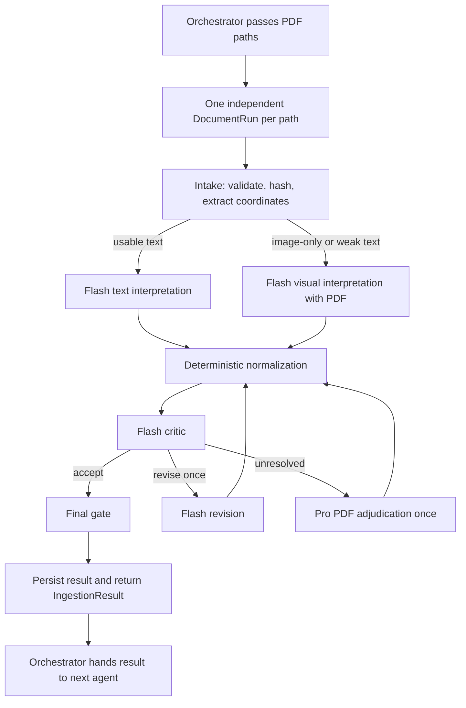

# Runtime architecture

`run_pipeline(paths)` creates a fresh `WorkflowState`, counter set, run ID, and artifact directory for every path. A bad file or provider failure does not stop the remainder of the batch.

## What each stage owns

`extraction.py` opens only accessible PDFs within the configured byte, page, and character limits. It creates a SHA-256 source record and groups PDF words into page blocks. Each block includes a page number, block ID, word IDs, and a bounding box in PDF points.

`providers.py` asks a provider for an `InvoiceProposal`, never a trusted invoice. A proposal contains source literals, evidence locators, confidence, alternatives, and an optional transformation suggestion. `GeminiProvider` uses structured JSON output. `FakeProvider` produces the fixture interpretation or controlled error responses for tests.

`normalization.py` is the trust boundary. It checks each cited locator against extracted evidence, then parses allowed money and dates and applies explicit aliases. It creates trusted `Decimal` or `date` values only after that check. Missing, ambiguous, unparsable, or unsupported values become typed `Issue` objects; they do not stop the workflow.

`workflow.py` owns all transitions. It tracks model requests, transport retries, critic runs, revisions, Pro escalations, and graph steps. A prompt cannot create more loops because routing only uses those counters and configured limits.

The final gate returns `ready_for_validation` when a structurally usable candidate exists, even if it carries issues. It returns `invalid_input` for source failures, `needs_review` when no safe candidate exists, and `technical_failure` for bounded infrastructure or storage failures.

## Audit output

By default every run is written below `src/invoice_system/ingestion/runs/<run_id>/` and is ignored by Git. It contains:

- `source.json`: path, size, media type, and SHA-256; the source PDF is never copied.
- `extraction.json`: deterministic pages, blocks, text, and locators.
- `interpret-*.json`, `critique-*.json`, `revise-*.json`, or `pro-*.json`: validated model outputs.
- `events.jsonl`: append-only node and model-attempt records with counters, prompt version, usage, latency, and outcome.
- `result.json`: the final handoff object.

API keys, PDF bytes, base64 payloads, hidden reasoning, and raw unrestricted prompts are intentionally absent.
